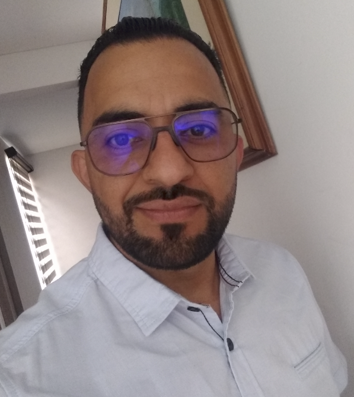

# Lasting Impression

Team **Lasting Impression** — Stage 1: environment recognition and team formation with Version Control System.

Programming for Video Games (213027) · Universidad Nacional Abierta y a Distancia (UNAD)

---

## About the project

This repository is the starting point of a collaborative video game development project. During Stage 1 the team sets up the working environment, defines roles from the game industry, agrees on a communication channel, and configures a shared repository with Git and GitHub.

In parallel, each member performs an analytical review of three international *games for change* references, connecting design and programming decisions with social, educational and cultural impact.

---

## Team members

### Samuel [Last Name]


- **Role:** Programmer / Video Game Developer
- **Location:** [City, Country]
- **Profile:** Programming student focused on video game development, gameplay systems and version control workflows. Interested in how technical decisions in Unity and C# shape the player experience and the social impact of interactive projects.

Favorite dish → [`/samuel/`](./samuel/)

---

### Sergio Martinez E



- **Role:** Engine Systems and Online Backend
- **Location:** Mosquera, Colombia
- **Profile:** Full-stack developer and professional UX designer focused on engine systems and online backend architecture for video games. He connects server-side reliability, networking and user-centered interfaces so multiplayer and social-impact projects stay playable, accessible and coherent for the player.

Favorite dish → [`/sergiomartinez/`](./sergiomartinez/)

---

### [Teammate 3 First Name] [Last Name]


- **Role:** Narrative Designer / Artist
- **Location:** [City, Country]
- **Profile:** [Brief 2–3 line description]

Favorite dish → [`/[firstname]/`](./)

---

## Repository structure

```
lasting-impression/
├── README.md              ← this file
├── CONTRIBUTING.md        ← Git workflow for the team
├── SPEC.md                ← activity checklist against the rubric
├── LICENSE
├── .gitignore
├── assets/profiles/       ← profile pictures referenced above
├── samuel/                ← Samuel's folder (favorite dish, personal assets)
├── sergiomartinez/        ← Sergio Martinez E (engine / online backend)
├── [firstname]/           ← remaining teammate creates their own folder
└── docs/
    ├── ficha-analitica.md ← games for change analysis
    ├── semilleros.md      ← research groups exploration
    └── evidencias/        ← screenshots (communication channel, etc.)
```

---

## Documentation

- Contribution workflow → [`CONTRIBUTING.md`](./CONTRIBUTING.md)
- Activity checklist → [`SPEC.md`](./SPEC.md)
- Games for change analysis → [`docs/ficha-analitica.md`](./docs/ficha-analitica.md)
- Research groups exploration → [`docs/semilleros.md`](./docs/semilleros.md)

---

## Communication channel

[Add here the platform once agreed — Microsoft Teams, Discord, WhatsApp, etc. Reference the interaction screenshot stored in `docs/evidencias/`.]

---

## Course information

| Field | Value |
|---|---|
| Course | Programming for Video Games |
| Code | 213027 |
| Institution | UNAD — Vicerrectoría Académica y de Investigación |
| School | Escuela de Ciencias Básicas, Tecnología e Ingeniería (ECBTI) |
| Program | Ingeniería Multimedia |
| Stage | 1 — Environment recognition and team formation with VCS |
| Version | v1.0 |


### Yisel Sofia Moreno Muñoz


- **Role:** Graphics / Rendering
- **Location:** Bogotá, Colombia
- **Profile:** Multimedia Engineering student focused on 3D modeling, asset creation, rendering, and visual optimization for interactive experiences. Interested in how visual fidelity, lighting, and performance influence player immersion in video games with social impact.

**Favorite dish:**


